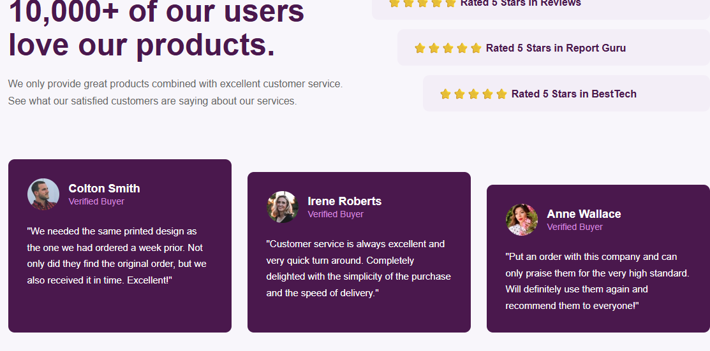

# Frontend Mentor - Social Proof Section Solution

This is my solution to the **Social Proof Section** challenge from Frontend Mentor. The project focuses on building a responsive testimonial section using HTML and CSS.

## Overview

### The Challenge

Users should be able to:

* View the optimal layout for the site depending on their device's screen size.
* See a responsive design that works on both desktop and mobile devices.
* Swipe through the testimonial cards on smaller screens.

### Screenshot

# 

### Links

* Solution URL: https://www.frontendmentor.io/solutions/YOUR-SOLUTION
* Live Site URL: https://YOUR-LIVE-SITE

## My Process

### Built With

* Semantic HTML5
* CSS3
* Flexbox
* Media Queries
* Mobile-first workflow

### What I Learned

This project helped me improve my understanding of responsive web design, Flexbox layouts, and CSS media queries. I also practiced creating a mobile-friendly horizontal scrolling section for testimonial cards.

### Continued Development

In future projects, I plan to improve my CSS layout skills, explore CSS Grid in more depth, and continue building responsive user interfaces.

## Author

* Frontend Mentor - https://www.frontendmentor.io/profile/eman719
* GitHub - https://github.com/eman719
